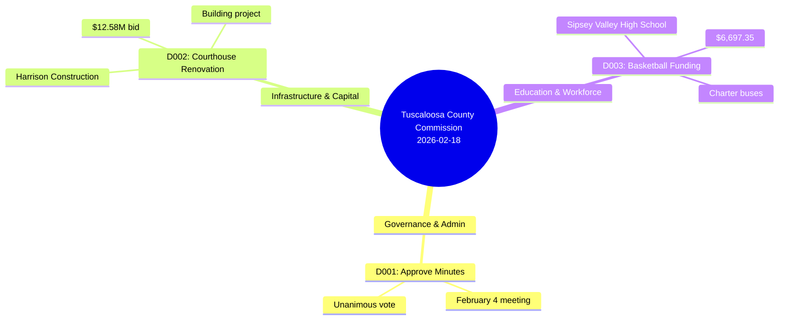

# Tuscaloosa County Commission

**Tuscaloosa County Commission** · 2026-02-18 · Tuscaloosa County, AL

## Decisions Mind Map

## Theme & Category classification

| ID | Topic | Primary theme | Category | Why (model) | Flags |
|---|---|---|---|---|---|
| D001 | Approve February 4 minutes | Governance and Administrative Policy | Category-01 | The decision involves the routine administrative approval of meeting minutes. | — |
| D002 | Award courthouse bid | Infrastructure and Capital Projects | Category-04 | The decision involves awarding a major construction contract for a public building. | — |
| D003 | Approve basketball funding | Education and Workforce | Category-09 | The funding is specifically for a high school athletic program. | — |

### Decisions (agenda, minutes, and recording)

#### D001 — Approve February 4 minutes
- **Headline:** Minutes approved unanimously
- **Decision:** The County Commission voted unanimously to approve the minutes of February 4, 2026.
- **Theme:** Governance and Administrative Policy (Category-01)
- **Why this theme:** The decision involves the routine administrative approval of meeting minutes.

#### D002 — Award courthouse bid
- **Headline:** Courthouse renovation bid awarded
- **Decision:** The County Commission voted unanimously to award the bid for Courthouse renovations to Harrison Construction in the amount of $12,580,000.00.
- **Theme:** Infrastructure and Capital Projects (Category-04)
- **Why this theme:** The decision involves awarding a major construction contract for a public building.

#### D003 — Approve basketball funding
- **Headline:** Basketball team bus funding approved
- **Decision:** The County Commission voted unanimously to approve a funding request of $6,697.35 to Sipsey Valley High School basketball team for two (2) charter buses.
- **Theme:** Education and Workforce (Category-09)
- **Why this theme:** The funding is specifically for a high school athletic program.

## People

**Members present:** Rob Robertson, Stan Acker, Jerry Tingle, Mark C. Nelson, Reginald Murray

| Name | Role | Appeared as | Party | Lobbyist |
|---|---|---|---|---|
| Rob Robertson | Chairman | Decision Maker | Unknown | — |
| Stan Acker | Commissioner | Decision Maker | Unknown | — |
| Jerry Tingle | Commissioner | Decision Maker | Unknown | — |
| Mark C. Nelson | Commissioner | Decision Maker | Unknown | — |
| Reginald Murray | Commissioner | Decision Maker | Unknown | — |
| April Hoffman | Chief Financial Officer | Staff | Unknown | — |
| Robert Spence | County Attorney | Legal Counsel | Unknown | — |
| Jeff Judd | Lt. | Staff | Unknown | — |
| Scott Anders | County Engineer | Staff | Unknown | — |
| Ron Abernathy | Sheriff | Referenced Only | Unknown | — |

## Source documents

- Agenda: `2026_02_18-Agenda.pdf`
- Minutes: `2026_02_18-MINUTES.pdf`
- Recording: `2026_02_18.mp4`

